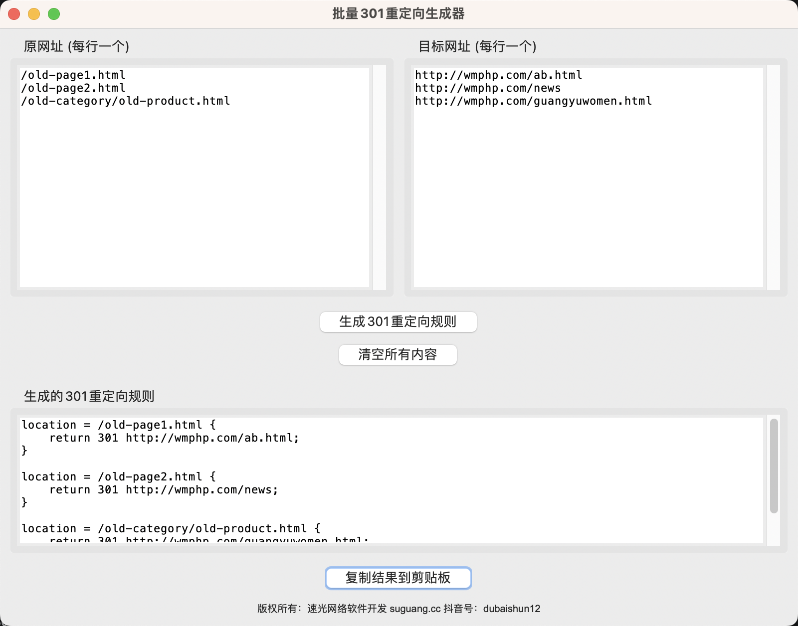

# 批量301重定向生成器

一个Python GUI应用程序，用于生成Nginx格式的301重定向规则。

## 特点

- 窗体自动在屏幕中央打开
- 用户友好的图形界面
- 底部显示版权信息

## 功能

- 在左侧文本框输入原始网址（每行一个）
- 在右侧文本框输入目标网址（每行一个）
- 自动生成Nginx格式的301重定向规则
- 支持一键复制结果到剪贴板
- 窗体自动居中显示
- 底部居中显示版权信息

## 使用方法

1. 运行程序：
   ```
   python redirect301_generater.py
   ```

2. 在左侧文本框中输入原始网址，每行一个：
   ```
   /old-page1.html
   /old-page2.html
   /old-category/old-product.html
   ```

3. 在右侧文本框中输入对应的目标网址，每行一个：
   ```
   https://newsite.com/new-page1.html
   https://newsite.com/new-page2.html
   https://newsite.com/new-products/new-product.html
   ```

4. 点击"生成301重定向规则"按钮

5. 生成的规则将显示在底部文本框中：
   ```
   location = /old-page1.html {
       return 301 https://newsite.com/new-page1.html;
   }

   location = /old-page2.html {
       return 301 https://newsite.com/new-page2.html;
   }

   location = /old-category/old-product.html {
       return 301 https://newsite.com/new-products/new-product.html;
   }
   ```

6. 可以点击"复制结果到剪贴板"按钮将结果复制到剪贴板

## 依赖

- Python 3.x
- tkinter (通常随Python一起安装)

## 注意事项

- 原网址和目标网址的数量必须相等
- 程序会自动处理URL路径提取
- 生成的规则适用于Nginx服务器配置

## 软件界面


## 技术支持

- **速光网络软件开发**
- 官网：suguang.cc
- 联系电话/微信：15120086569
- 抖音号：dubaishun12

## 版权信息

Copyright © 2025 速光网络软件开发. All rights reserved.

---